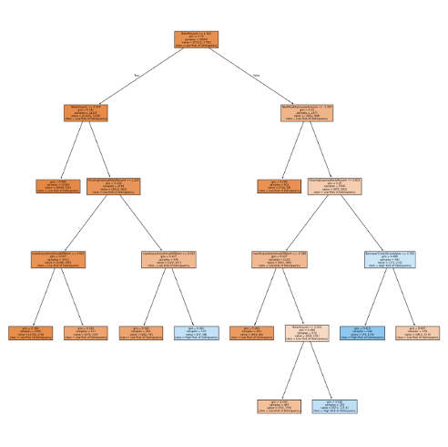
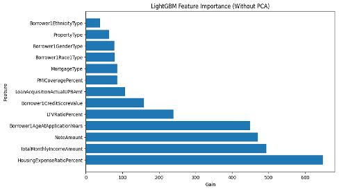
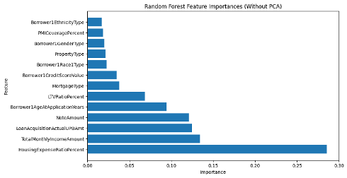
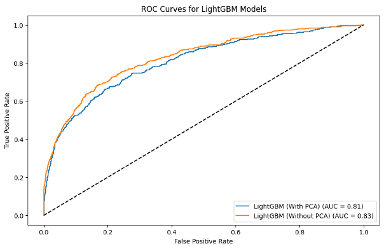
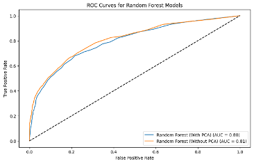

# Disparities in Mortgage Lending and Payments during the COVID-pandemic using Supervised Machine Learning Models

This project explores the racial disparities in mortgage lending and payment delinquencies during the COVID-19 pandemic using supervised machine learning models. Black and Hispanic homeowners, historically marginalized in the U.S. housing market, experienced disproportionately higher risks of delinquency compared to White homeowners. This study evaluates how demographic and financial factors contribute to these risks while assessing the effectiveness of pandemic-era relief programs, such as mortgage forbearance policies under the CARES Act.

Using data from the Federal Home Loan Bank System (2020-2022), the project employs advanced machine learning techniques, including Decision Trees, Random Forests, Logistic Regression, and LightGBM. These models are used to analyze over 21,000 borrower records and identify key predictors of mortgage delinquency. The findings provide insights into structural inequities and inform policy recommendations for equitable housing practices.

## Motivation 

The COVID-19 pandemic revealed and deepened pre-existing financial inequities in the housing market. Minority homeowners, already facing higher interest rates and limited access to refinancing, were particularly vulnerable to economic shocks. This project was driven by a desire to quantify these disparities, evaluate the effectiveness of relief measures, and propose actionable solutions to promote fairness in the housing market.

## Problem Statement

Despite efforts to address financial inequities, racial and ethnic disparities in mortgage lending and delinquency persist. Minority borrowers are more likely to face challenges such as higher housing expense ratios, lower credit scores, and limited financial flexibility. This study seeks to understand the interplay between demographic characteristics and financial predictors in determining mortgage delinquency risks, particularly during a period of unprecedented economic uncertainty.

## Finding

The analysis identified significant insights into the financial and demographic predictors of mortgage delinquency:
1. **Housing Expense Ratio:** Borrowers with higher housing expense ratios were consistently at greater risk. For instance, a ratio above 30% increased the likelihood of delinquency significantly, with the feature contributing over 40% of the predictive power in Random Forest models.
2. **Credit Scores:** Credit scores showed strong predictive value. Borrowers with scores below 600 were categorized as high risk, while those above 750 were consistently low risk, demonstrating a clear correlation between creditworthiness and repayment stability.
3. **Loan Amounts:** Borrowers with smaller loans (e.g., below $150,000) were at lower risk of delinquency. Conversely, loans exceeding $300,000 correlated with higher risk.
4. **Loan-to-Value (LTV) Ratios:** An LTV ratio above 80% increased delinquency risk. Borrowers with higher equity in their homes demonstrated more financial stability.
5. **Demographics:** While demographic factors like race and ethnicity had lower predictive importance, the data showed that Black and Hispanic borrowers were overrepresented in the high-risk category, pointing to systemic financial inequities.

## Supervised Machine Learning Methods and the Results

1. The **Decision Tree model** achieved an AUC score of 70%, highlighting key predictors such as credit scores and loan size.
2. The **Random Forest model**, with an AUC score of 81%, identified housing expense ratio (41% importance) and loan acquisition amount (25% importance) as the most critical factors.
3. **Logistic Regression** analysis found that credit score and housing expense ratio were statistically significant, with p-values below 0.01.
4. **LightGBM**, the most effective model, achieved an overall accuracy of 91% and an AUC score of 83%. It demonstrated 91% precision for low-risk borrowers and 72% precision for high-risk borrowers.

  

  

  

   

## Challenges and Future Work 
This project presented several challenges:
1.	Managing large datasets with skewed distributions, particularly in financial variables like income and loan-to-value ratios.
2.	Ensuring interpretability in models like LightGBM while maintaining high accuracy.
3.	Addressing data limitations, such as missing values and uncontrolled variables like lender-specific policies and local economic conditions.

Future research should include:
1. Qualitative analysis to understand borrowers' lived experiences and the impact of systemic barriers.
2. Regional analysis to identify local trends in mortgage delinquency and lending practices.
3. Examination of policy reforms targeting non-bank lenders, who disproportionately charge minority borrowers higher fees.

